# PRD：巴黎城市时空文化地图

> **一句话**：把巴黎的 POI、名人、作品与影视场景重新缝回它们发生的时间和地点上，做成一张可读、可逛、可讲给朋友听的地图。MVP 聚焦巴黎，纯静态站，桌面优先，中英双语，不商业化。

**📺 [在线体验交互原型](https://zhengxinyu31-byte.github.io/paris-storymap/demo/)** · 📄 [需求 Spec（事实源）](../specs/requirements.md)

---

## 一、背景与目标

### 1.1 需求背景

参考境内项目 [StoryMap](https://github.com/cuizicheng1024/storymap) 的底层框架与设计思路，做一个聚焦境外城市的时空文化地图。两者的关键差异：

| | 参考项目 | 本项目 |
|---|---|---|
| 地域 | 境内 | 境外（MVP 仅巴黎） |
| 主体 | 历史人物 | **城市里的 POI** |
| 目标场景 | 中学教学 | 旅游 / 娱乐轻松向 |

**市场机会**（调研结论）：

| 发现 | 具体情况 |
|---|---|
| 头部品牌有内容没产品 | **Paris ZigZag** 是巴黎本地头部文化品牌，58 万粉丝、月访问 50 万，**却没有地图、没有 App，且刚退出体验业务** |
| 成熟竞品绕开了巴黎 | **Secret City Trails** 覆盖 50+ 欧洲城市，**唯独没有巴黎** |
| 数据侧异常慷慨 | 14,760 条带片名的官方取景地、2,619 块名人铭牌、Atget/Marville 老巴黎影像全套 CC0 |

**结论：内容原料免费且顶级，缺的是把它组织成「可走的故事」的产品。**

### 1.2 业务目标与成功指标

| 目标 | 对应的成功判据 |
|---|---|
| 把巴黎的文化记忆变成**可读、可逛、可讲给朋友听**的故事 | 用户愿意截图分享某个 POI 的故事；用户能被一条故事线勾住、一路点到底 |
| 建立**自动化交叉验证**的内容生产管道，使内容既可靠又不依赖人工逐条核实 | Hero 层 POI 事实字段 100% ≥L2 置信度；自动质检通过率 ≥70% |
| 验证「城市 × 文化 × 时空」产品形态，为扩展到其它境外城市打底 | MVP 上线并完成一轮用户反馈收集 |

> 量化运营指标（DAU / 留存 / 分享率）待上线前补充，埋点设计见第五章。

### 1.3 范围边界

**MVP 明确不商业化**，数据源选型以「能用好用」为准，不做许可传染性隔离；若未来转商业化需重新评估。

以下几项**明确不做**，且都容易被误解为「漏了」，在此说明原因：

- **「行中按图索骥」现场打卡** — 定位收敛为「行前找灵感 + 云逛巴黎 + 行后回味」的桌面端体验。移动端仅保底可用（不崩版、地图可用），不做适配投入，现场场景留作 V2 专项。
- **AI 人格化对话** — 依赖后端服务，纯静态站不支持，留到 V2。
- **UGC 内容共创** — 竞品 Placing Literature 三年仅积累 3,000 点后停摆，纯众包无编辑不可行。
- **AR 合影** — 舞台めぐり 做到极致仍然失败，Streetmuseum 同。
- **付费音频漫步** — Detour 已死、Gesso 转型、Paris ZigZag 直接退出该业务。

完整非目标清单（16 项，均附排除原因）见 [需求 Spec 第 5 节](../specs/requirements.md)。

---

## 二、用户与场景

### 2.1 目标用户

- **主力**：计划去巴黎旅行、或刚从巴黎回来的中文用户。对文艺内容有兴趣，但不愿读长文。
- **次要**：影视与文学爱好者（《午夜巴黎》《天使爱美丽》《爱在日落黄昏时》受众）、法语学习者、云旅游人群。

> 用户不是研究者也不是学生。**「有梗、能拍照、能讲给朋友听」比「历史意义重大」更重要。**

### 2.2 核心场景

| # | 场景 | 用户在做什么 |
|---|---|---|
| 1 | **行前找灵感** | 在桌面端做攻略，浏览地图与故事线，发现有意思的地方，规划想去哪些地方 |
| 2 | **云逛巴黎** | 不一定真要去，就是喜欢看这座城市的故事；被某个 POI 或某条线勾住，一路点下去 |
| 3 | **行后回味与分享** | 把某个 POI 的故事、某条走过的路线分享出去，作为谈资 |

### 2.3 产品调性（作为产品要求，非建议）

**旅游向 + 一点点文艺 + 主要是娱乐轻松向。**

文案风格是「一个懂行的朋友带你逛」，不是导游词也不是维基百科，**可以有幽默和吐槽**。

因产品不覆盖现场场景，POI 详情页对应模块为「**📷 这地方为什么好看**」——讲视觉特征与画面感，服务于想象力和分享欲，**不是现场拍摄指引**。

---

## 三、主用户旅程

两个入口进入，汇聚到同一条深度消费路径。**POI 与主题线是多对多关系，构成无边界游走的闭环**——这是本产品的核心动线特征。

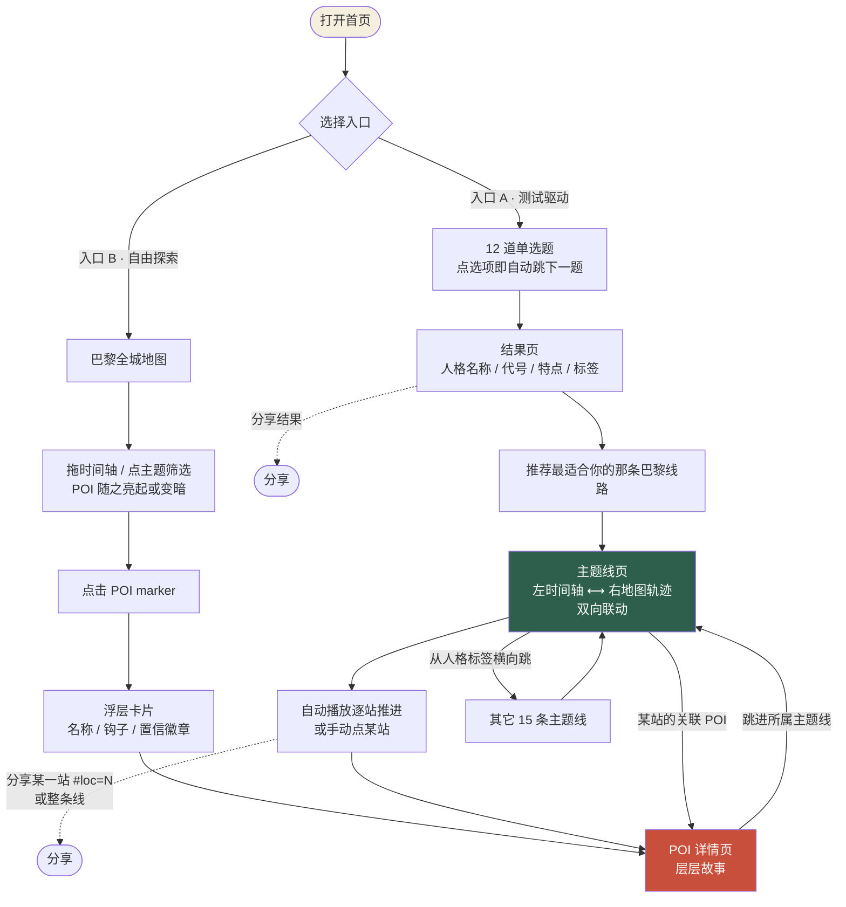

---

## 四、功能需求

### 4.1 功能概览

<table>
<thead><tr><th>功能点</th><th>说明</th><th>优先级</th></tr></thead>
<tbody>
<tr><td>POI 内容体系</td><td>约 300 个 POI 三层分级（Hero 40 / Story 100 / Pin 160）</td><td>P0</td></tr>
<tr><td>知识库与内容生产管道</td><td>自动化交叉验证，L1–L5 分级 + C1–C8 冲突规则 + LLM 红线</td><td>P0</td></tr>
<tr><td>首页：全城地图 + 时间轴</td><td>真实街道级底图，7 段时代筛选，marker 三级信息密度</td><td>P0</td></tr>
<tr><td>故事线体系</td><td>16 条主题线，主题为主体、人格为标签</td><td>P0</td></tr>
<tr><td>POI 详情页</td><td>层层故事、关联实体、置信徽章、辟谣卡片</td><td>P0</td></tr>
<tr><td>主题线页</td><td>左时间轴 ⟷ 右地图双向联动，自动播放，深链分享</td><td>P0</td></tr>
<tr><td>人格测试与结果页</td><td>12 题，点选项自动跳题，结果推荐对应主题线</td><td>P0</td></tr>
<tr><td>差异化内容层：辟谣</td><td>「铭牌怎么说 vs 实际发生了什么」，无竞品有此角度</td><td>P1</td></tr>
<tr><td>时间维度</td><td>年代作为一等筛选维度，7 段时代分层</td><td>P1</td></tr>
<tr><td>双语与全局语言切换</td><td>中英双语，法文原名始终显示</td><td>P1</td></tr>
<tr><td>徽章与标注体系</td><td>L1–L5 置信徽章 + 三条正交实用标注</td><td>P1</td></tr>
<tr><td>搜索与筛选</td><td>多维搜索（中/法/英名 + 别名），暴露匹配原因</td><td>P2</td></tr>
</tbody>
</table>

### 4.2 POI 内容体系

以巴黎 POI 为主体，每个 POI 承载「这里发生过什么、关联哪些名人/作品/影视」的层层故事。

| 层级 | 数量 | 内容深度 | 生产方式 |
|---|---|---|---|
| Hero（核心） | 约 40 | 深度内容 + 人工终审 | 半自动 |
| Story（次级） | 约 100 | 轻量内容 | **全自动** |
| Pin（长尾） | 约 160 | 仅列点 | **全自动** |
| **合计** | **约 300** | | |

**选点原则**：优先选**能同时挂 3–5 条故事线**的 POI，让内容密度显著高于条目数。典型如旺多姆广场——肖邦逝世 + 《Lupin》黑珍珠劫案 + 库尔贝推倒纪功柱，一点三线。

**覆盖范围**：核心街区优先——拉丁区、圣日耳曼、蒙马特、玛黑。

### 4.3 知识库与内容生产管道

> **语料库必须自建。这是本项目的护城河。**

项目要求「交叉验证，但尽量没有人工核实素材真伪的环节」。这两件事看似矛盾，解法是把判真从人的直觉变成机器可执行的规则。

#### 内容判真法则

> **能说清「为什么是这家、哪一年、什么具体细节」的掌故大概率是真的；只有一串名字的，那是菜单的一部分。**

依据是造假成本：营销文案倾向罗列名人（「海明威、菲茨杰拉德都来过」），因为名字不需要考据、无法证伪；而真实史料自带年份、场景和动机。

**工程化**：每条「人物 ↔ POI」关联必须填齐三字段，**缺一即自动降为 L4**，不进主推内容。

| 字段 | 含义 |
|---|---|
| `why_here` | 为什么是这个地方 |
| `when` | 具体年份或年代区间 |
| `detail` | 一个具体到能让人复述的细节 |

#### 端到端流水线

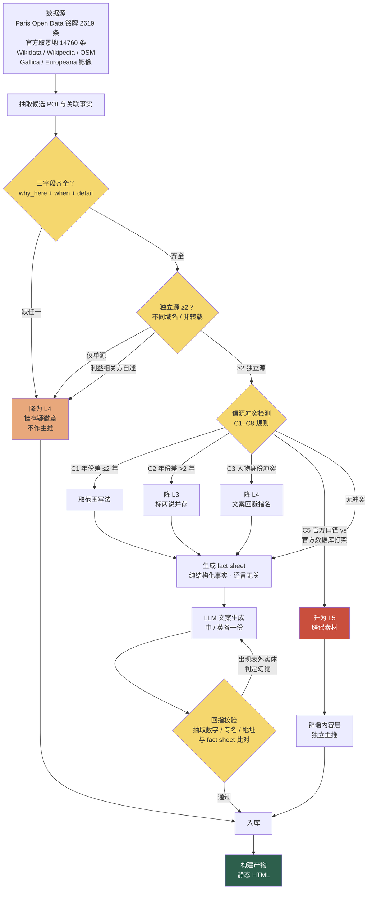

#### 置信度分级（字段级，非 POI 级）

分级挂在**字段**上。一个 POI 完全可能地址是 L1、关联人物是 L2、某个传说是 L5。

| 级别 | 判据 | 徽章 | 文案 |
|---|---|---|---|
| **L1** | 官方数据集 / 权威档案直接记载 | 🏛 有据可查 | （不显示） |
| **L2** | ≥2 独立信源一致，三字段齐全 | 📎 大家都这么说 | 「多数资料指向这里，但没有一锤定音的证据。」 |
| **L3** | ≥2 独立信源但细节有出入 | 🗝 只有一个出处 | 「这件事只在（来源）里出现过一次。」 |
| **L4** | 单一信源 / 三字段不齐 / 仅利益相关方陈述 | ✨ 未经证实，但很好听 | 「查无实据，不过我们决定留着。」 |
| **L5** | 已被证伪，或官方口径与官方数据自相矛盾 | 🔍 著名的假故事 | 「这个传说太有名了，有名到值得专门讲讲它是怎么假的。」 |

**L5 不是垃圾桶，是金矿。** 被证伪的传说构成本产品最独特的内容层。

#### LLM 红线（工程强制，不靠 prompt 约束）

1. **fact sheet 是唯一输入** — LLM 收到结构化字段，不是「请介绍花神咖啡馆」。
2. **输出后做回指校验** — 抽取生成文本里所有数字、专名、地址，与 fact sheet 比对。**出现表外实体即判定幻觉，自动重新生成。**
3. **不允许 LLM 填空** — 字段缺失就是缺失，不允许「根据常识补充」。

这三步是代码层面的强制校验，不是写在 prompt 里的请求。

#### 实战验证

这套规则在语料搜集阶段立刻见效，记录三个真实发现：

- **Wikidata 的人物-地点关联落不到建筑** — 实测 P19/P20/P551，绝大多数只解析到「区」级。「某名人住过这栋楼」必须用铭牌数据集补。
- **候选清单里三分之一的点是死的或将死的** — 一轮核实剔除了 Chez Gégène（2024 年 12 月关门）、Les Grands Voisins（2020 年 9 月永久关闭）、La Hune（2015 年关闭）、蒙帕纳斯 56 层观景台（2026 年 3 月关闭至少 4 年）、约瑟芬·贝克泳池（2026 年底退役）。
- **最响亮的细节往往最不可信** — 「达利要求 Le Meurice 送一群羊到房间」在 5 个以上域名可查，但**措辞逐字相同，多处标注转引自酒店官网**，属利益相关方单一来源（L4）。

由此得出一条产品约束：**L4 可以进内容，不能进门面。主题名只能建立在 L1–L2 素材上**——主题名出现在首页、分享卡片与搜索结果，不可挂徽章、不可静默降级。

### 4.4 首页：巴黎全城地图 + 时间轴

一眼看到整座城市的文化密度，并能按时代 / 主题切片。

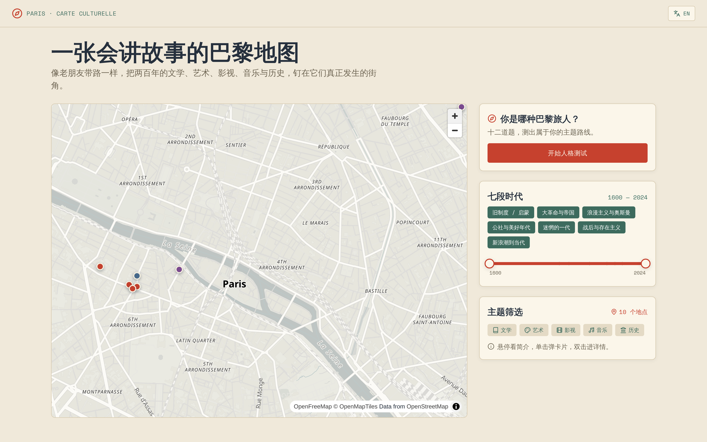

**核心元素**：真实街道级底图（MapLibre，POI 以 marker 呈现，**不做聚合**）、7 段时代预设时间轴、主题筛选器（文学/艺术/影视/音乐/历史）、搜索框。

**底图硬性要求**：必须能看清街道名、建筑轮廓与塞纳河走向，能缩放到单栋建筑级别。项目不商业化，按「能用好用」选型——首选 OpenFreeMap（零 key、无配额），次选免 key 栅格瓦片。**任何用色块、SVG 示意图、静态截图冒充地图的做法均不合格。**

> ⚠️ **已知坑**：CARTO 的矢量瓦片端点需要 API key。未授权时它不报错，而是返回一张印着 `API KEY REQUIRED` 却同时画了淡灰街道线和 `PARIS` 字样的**占位纹理**，极易被误判为「底图已接上」。识别方法：放大后看不到任何街道名。

**三级信息密度交互**（沿用参考项目）：

| 操作 | 反馈 |
|---|---|
| hover marker | tooltip 卡片（名称 / 年代 / 一句话钩子） |
| 单击 marker | 浮层卡片 + 「查看详情」按钮 |
| 双击 marker | 直接进 POI 详情页 |

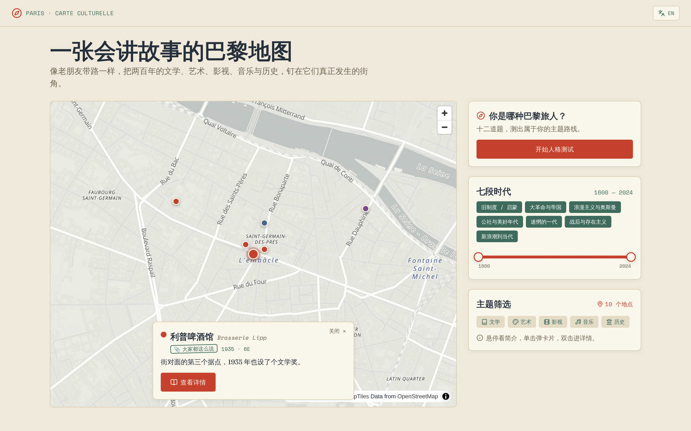

**状态**：加载中、筛选后空态（「这个时间窗里巴黎很安静」）、地图加载失败降级。

### 4.5 时间维度：年代作为一等筛选维度

> ⭐ **整个赛道没有一个产品把年代当成一等筛选维度**，这是核心差异化点。

**7 段时间分层**（与铭牌数据集 `periode_1` 字段天然对齐）：

| # | 时代 | 年份 |
|---|---|---|
| 1 | 旧制度 / 启蒙 | –1789 |
| 2 | 大革命与帝国 | 1789–1815 |
| 3 | 十九世纪浪漫主义与奥斯曼改造 | 1815–1870 |
| 4 | 公社与美好年代 | 1871–1914 |
| 5 | **迷惘的一代** | 1918–1939 |
| 6 | **战后与存在主义** | 1940–1959 |
| 7 | 新浪潮到当代 | 1960– |

每段都同时有「人物 + 作品 + 影视 + 事件」四类内容。**第 5、6 段内容最厚、国际认知度最高，作为首发主推。**

**交互**：时间轴拖动 → 地图 marker 显隐 / 大小 / 高亮同步刷新 + **计数实时更新**。支持框选刷取与双击重置。

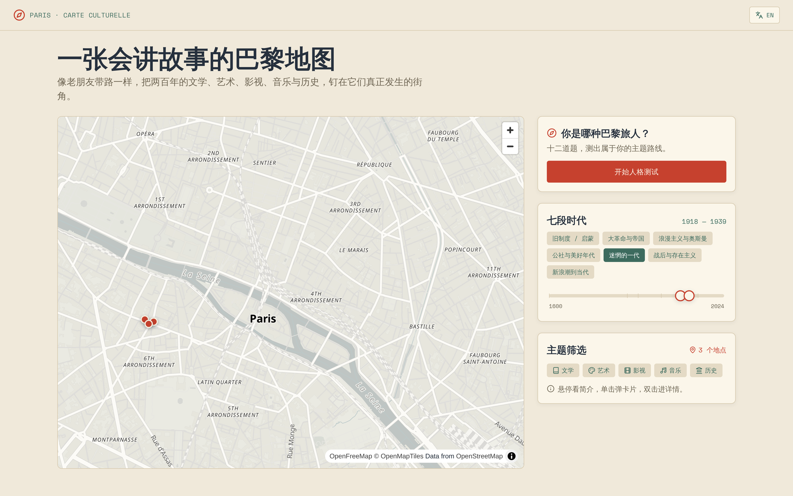

> 上图为点选「迷惘的一代」后的状态：年份区间由 `1600—2024` 收拢至 `1918—1939`，POI 计数由 10 个减至 3 个，地图 marker 同步减少。

**两层时间字段**：`事件年代`（雨果住此 1832–1848）+ `素材年代`（这张 Marville 照片摄于 1865），分别驱动「按年代筛地图」与「今昔对照」。

### 4.6 故事线体系

把 POI 用**主题**串成可消费的线路。POI 与故事线是**多对多**关系。

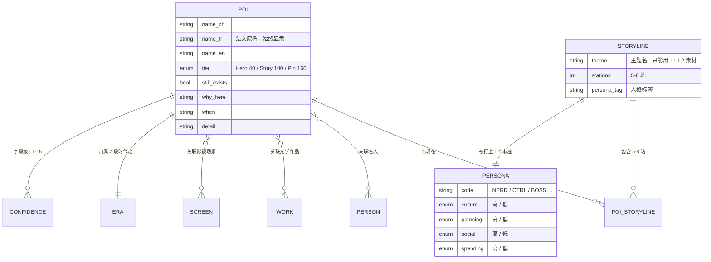

#### 组织逻辑：主题为主体，人格为标签

**核心是「主题故事线」** —— 每条线有自己独立的主题魅力。**人格是给每条主题线打的标签**，用于测试后的匹配推荐，而不是线路的生成逻辑。

> ⚠️ **不是「为 16 种人格各造一条线」。** 若按人格造线，会导致同一批 POI 换个说法讲 16 遍、内容严重同质。正确做法是**先有好主题，再判断它天然吸引哪类人**。

#### 16 条主题线

| # | 主题线 | 人格 | # | 主题线 | 人格 |
|---|---|---|---|---|---|
| 1 | 一杯咖啡坐一天，顺便发明了存在主义 | NERD 学者 | 9 | 艾米莉的十五分钟人生 | BEE 小蜜蜂 |
| 2 | 巴黎最有名的几块铜牌，都写错了 | CTRL 宝藏团长 | 10 | 有钱人的怪癖，后来都成了景点 | LORD 大小姐 |
| 3 | 《午夜巴黎》的十二点魔法 | BLUE 深藏Blue之人 | 11 | 桌上的排面：巴黎名店坐席学 | BOSS 煤老板 |
| 4 | 海明威的穷日子 | MYTH 拾光者 | 12 | 一个人的巴黎时刻表：从水下到屋顶 | FREE 多比 |
| 5 | 蒙马特的画家们 | DODO 干就完了 | 13 | 废线之上：一条被巴黎丢掉的路 | WIND 追风筝的人 |
| 6 | 拉雪兹神父公墓的名人局 | BUDD 清冷佛子 | 14 | 一起吃、一起跳：巴黎的大桌子考古 | SHAN 慈善家 |
| 7 | 《爱在日落黄昏时》的那个下午 | GOAT 全能管家 | 15 | 没人来赶你：巴黎的七个不走也行的地方 | REST 休息者 |
| 8 | Emily in Paris 打卡路线 | TIME 时间管理大师 | 16 | 街头扭蛋：巴黎怪东西捡漏指南 | CUTE 史莱姆 |

第 10–16 条线共 57 站的完整站序、逐段距离与状态标记见 [station-list.md](./station-list.md)。

#### POI 复用规则

- **核心 POI 允许大量重合**，这是设计预期而非缺陷。16 条线共用一个 POI 池。
- 每条线 **5–8 站**，其中允许 **1–3 站为该线专属**。
- 重合的 POI 在不同主题线下**叙事角度不同**。例：花神咖啡馆在 NERD 线讲 1939 年的煤炉与存在主义谱系，在 REST 线讲「找个位子坐一下午没人赶你」。但这是主题差异带来的自然结果，不是为凑人格刻意改写。

### 4.7 主题线页

本产品最核心的深度消费页面。

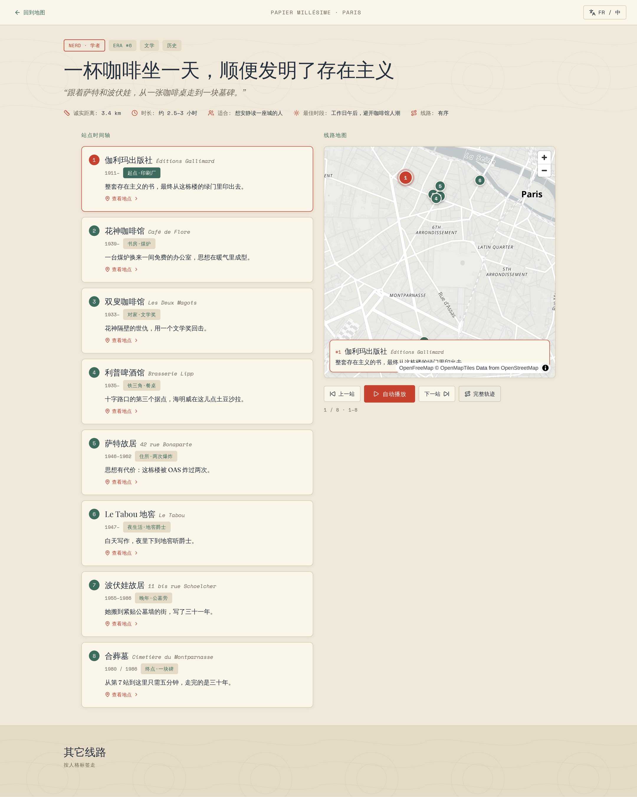

**布局**：左侧站点时间轴 ⟷ 右侧地图轨迹（按顺序连接各站，分段配色渐变，带方向箭头）。

**双向联动**：点时间轴卡片 → 地图 `flyTo` 该站；点地图 marker → 时间轴对应卡片高亮。

**自动播放**：每约 2 秒推进一站，时间轴高亮 + 地图飞行 + 浮卡换内容 + URL hash 同步。

**业务规则**：

- 步行距离与时长**必须诚实标注**。《爱在日落黄昏时》实测 10.1km / 3–3.5 小时，而电影只有 80 分钟——**不得宣传成「实时走完电影」**。第 13 条线全长约 14–15 km，明确标注「需要一整天」。
- 高 planning 人格对应的线须给明确站序与时长；低 planning 对应的线不强制顺序，按片区分组。
- 支持**日/夜双段结构**（如《午夜巴黎》线以钟敲十二下为分界）。
- 允许同一街区承载**态度相反**的两条线（海明威线「拆穿传说」vs 午夜巴黎线「享受传说」）。
- **跨城市站点须显式标注**：含巴黎市域外站点（吉维尼约 75km、凡尔赛 RER 45 分钟）时标为「需单独一日」，并排除在步行距离统计之外。

### 4.8 POI 详情页

讲透一个地点的所有故事。

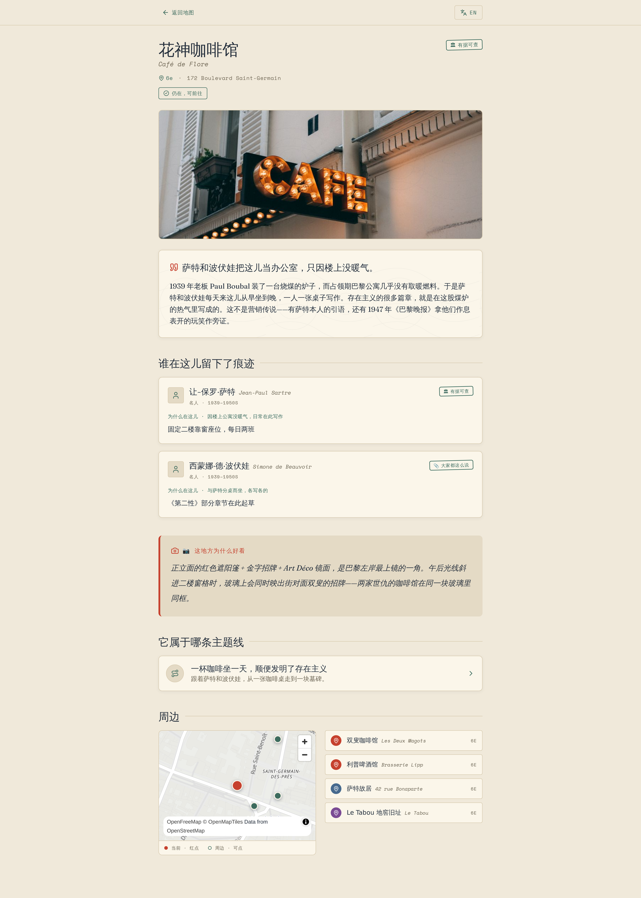

**核心元素**：

- **头部**：名称（中文 + 法文原名）、所在区、地址、**是否仍存在可访问**、置信徽章、实用标注
- 一句话钩子 + 主叙事
- **关联实体区**：关联名人 / 文学作品 / 影视场景，每条带 `why_here` + `when` + `detail`，**各自独立挂置信徽章**
- **📷 这地方为什么好看** — 讲视觉特征、画面感、有什么梗，服务于想象力与分享欲
- **所属故事线** — 该 POI 出现在哪几条线里，可直接跳入
- **辟谣卡片**（若有 L5 内容）
- 小地图 + 周边 POI

**状态**：内容缺失时不显示空区块；L4/L5 内容强制带徽章。

### 4.9 差异化内容层：「铭牌怎么说 vs 实际发生了什么」

把交叉验证的副产物做成独立内容层。**目前没有任何竞品地图有这个角度。**

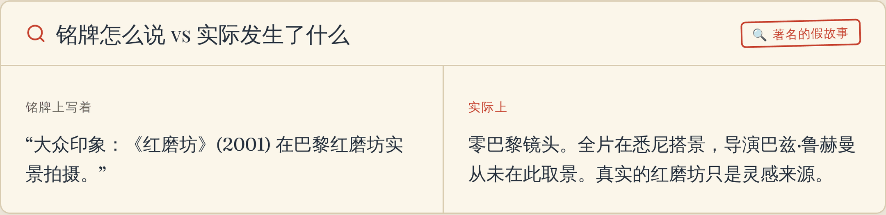

最有价值的素材是**巴黎官方铭牌本身就有错**：

| 铭牌说法 | 实际 |
|---|---|
| 皮雅芙生于贝尔维尔街 72 号台阶上 | 出生证明写的是 Tenon 医院 |
| 普罗可布咖啡馆铭牌写 1656 年 | 实为 1686 年，给自己早写了三十年 |
| 雨果故居说 1832 入住 | 同一面墙的铭牌说 1833 |

其它高价值辟谣（调研共推翻 40 条流传说法）：

- **Le Procope「法国最老咖啡馆」的连续性是营销** — 1686 年那家 1890 年就倒闭了，中间空了 67 年（期间还开过 Bouillon Chartier），1957 年才有人用同名在同一堵墙里开新店。店里那张「伏尔泰的大理石桌」是 1957 年后布置进空壳的陈设。
- **《达芬奇密码》的「玫瑰线」是丹·布朗编的** — 巴黎人只叫 médaillons Arago。小说还把两条线混为一谈：圣叙尔比斯那条黄铜线属于日晷仪（推算复活节用），与阿拉戈铜牌**相距 115 米**。电影版还为它付了版权费，因为铜牌是在世艺术家 1994 年的作品。
- **钓鱼猫街「巴黎最窄」是官方在传谣** — 它最窄 1.57 米；12 区樱桃木小径最窄 **87 厘米**。巴黎市政方仍把钓鱼猫街列为全市最窄，**尽管官方道路名录里记录了大量更窄的路**。
- **《天使爱美丽》照相亭在北站不是东站**（"NORD" 被改成 "EST"）；**《红磨坊》(2001) 在巴黎零取景**（全片悉尼拍摄）；**《John Wick 4》凯旋门戏在柏林废弃机场拍**。

**特殊类型标注**：「**主体，非取景地**」——用于红磨坊这类名气来源于此但未在此拍摄的 POI。

### 4.10 人格测试与结果页

用轻量测试帮用户找到「属于自己的那条巴黎」，同时作为分享裂变入口。

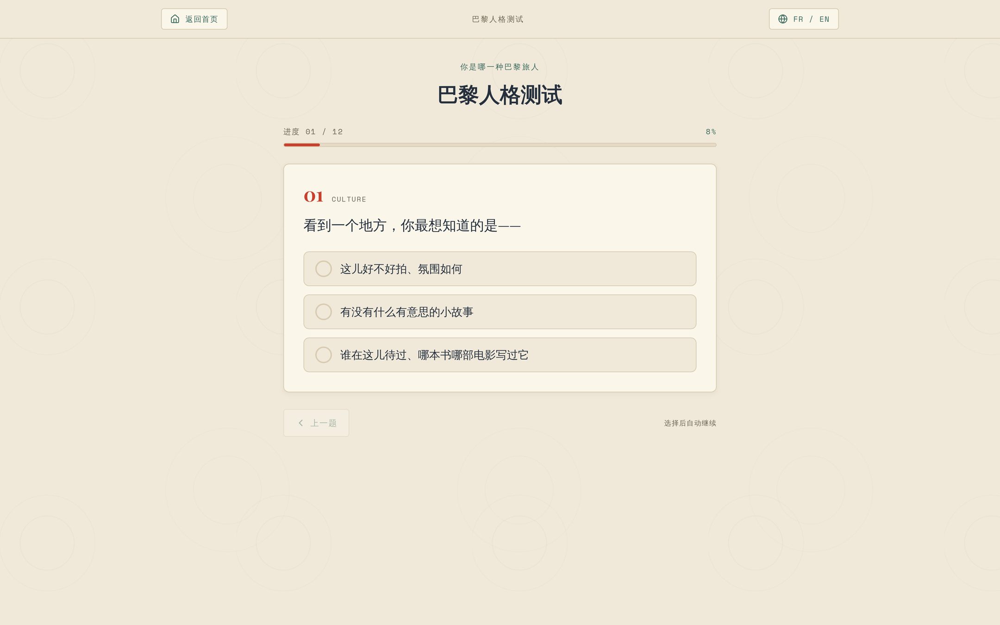

**测试页**：

- **12 道单选题，单题单屏**，每题 3 个选项
- **点击选项即自动进入下一题**，无「下一题」按钮。点击后给约 200–300ms 选中反馈再切题，让用户确认点中了什么
- 题间横向滑入动效，进度条同步推进
- **答完第 12 题自动进入结果页**，无「提交」按钮
- 进度指示常驻；支持返回上一题修改，返回时原选项保持选中，重新点击即覆盖并再次自动前进

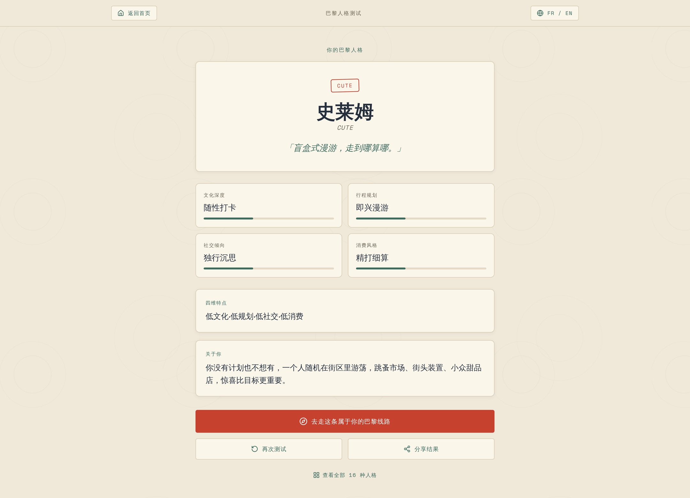

**结果页**：人格名称 + 英文代号 + 四维特点 + 一句话标签 + 结果描述，**推荐对应的那条主题线**（主 CTA），另有「再次测试」「分享结果」与「查看全部 16 种人格」。

**计分规则**：4 个维度各 3 题，每题 0/1/2 分，维度总分 **≥4 判为「高」**，<4 判为「低」。

**测试不是强制前置**：未测试用户可自由浏览全部 16 条主题线；每条线也都展示自己的人格标签，用户可反向按人格找线。

### 4.11 徽章与标注体系

置信徽章见 4.3。此外有**三条正交的实用标注**（直接影响差评率）：

🚪 只能在外面看 ｜ 🤫 私宅请轻声 ｜ ⏳ 需预约/看季节

### 4.12 双语与全局语言切换

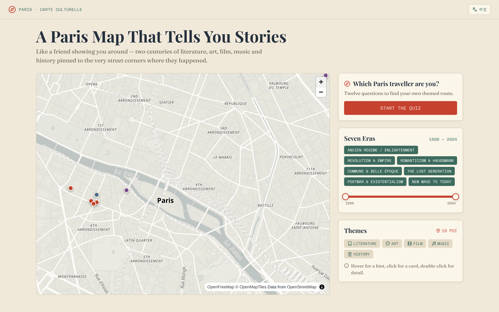

- **全局行为**，不是逐页设置。切换时保持当前页面与状态（含 `#loc=N`）不丢失。
- **专名三语并存**：POI 同时存中文名、**法文原名**、英文名。**法文原名在两种语言下始终显示**——这是实地找路的依据，不可只显示译名。
- **译名走固定词表**：人名、作品名、影视片名的中文译名由词表管理，词表外进人工，**不允许 LLM 自由翻译**。
- **中英文案不是互译关系而是各自撰写** — 中文面向中文用户介绍巴黎，英文面向国际游客，梗与语气可以不同。但**事实字段（坐标/年份/关联/取景地）必须完全一致**，共用同一份 fact sheet。
- 引文、台词、铭文原文**保持原始语言**，可附译文但须标明。
- **降级策略**：某条目英文文案缺失时回退显示中文并标注，不阻塞发布。

**对内容生产的影响**：叙事文案量约翻倍，事实层不翻倍（两语言共用同一份 fact sheet）；回指校验对两种语言各跑一次。

### 4.13 搜索与筛选

- **多维搜索**：支持中文名、法文原名、英文名、别名。**把匹配原因暴露给用户**。
- **别名重定向**：巴黎 POI 的中/法/英多名互相跳转。
- **片名别名表**（必需）：大制作用代号报备（《碟中谍6》报备名为 `GEMINI`），需建立映射。
- **筛选维度**：主题（文学/艺术/影视/音乐/历史）、时代（7 段）、街区。

> ⚠️ **当前原型未实现搜索入口**，为待补项。

---

## 五、数据与指标

量化运营指标待上线前确定，但埋点需在首版随功能上线，否则核心定性指标无法度量。

<table>
<thead><tr><th>观测目标</th><th>需要采集的行为</th><th>对应业务目标</th></tr></thead>
<tbody>
<tr><td><b>分享意愿</b></td><td>POI 页分享、故事线整条分享、某一站深链分享、人格测试结果分享——分别计数</td><td>「愿意截图分享某个 POI 的故事」</td></tr>
<tr><td><b>故事线完读深度</b></td><td>进入故事线后浏览到第几站、是否用了自动播放、是否走完全线</td><td>「被一条故事线勾住、一路点到底」</td></tr>
<tr><td><b>时间轴使用率</b></td><td>时间轴被拖动 / 时代预设被点击的比例，及各时代被选中的分布</td><td>验证「年代作为一等筛选维度」这一差异化假设是否成立</td></tr>
<tr><td><b>人格测试漏斗</b></td><td>测试入口曝光 → 开始答题 → 各题流失 → 完成 → 点推荐线路 CTA</td><td>测试作为发现路径与裂变入口的有效性</td></tr>
<tr><td><b>POI ⟷ 故事线互跳</b></td><td>从 POI 页跳进故事线、从故事线某站跳到关联 POI、横向跳其它线的次数</td><td>验证「无边界游走」这一核心动线是否被真实使用</td></tr>
<tr><td><b>辟谣内容层反响</b></td><td>含辟谣卡片的 POI 页停留时长与分享率，对比不含的 POI</td><td>验证辟谣是否构成差异化吸引力</td></tr>
<tr><td><b>语言切换</b></td><td>切换次数、切换后是否继续浏览</td><td>双语投入的 ROI 判断</td></tr>
<tr><td><b>地图降级</b></td><td>底图加载失败率（含授权占位纹理被识别的情况）</td><td>技术可用性监控</td></tr>
</tbody>
</table>

---

## 六、验收标准

### 6.1 内容质量

- [ ] Hero 层约 40 个 POI，主叙事事实 100% ≥L2 置信度，且每个至少含一条 L1 事实
- [ ] 每条「人物 ↔ POI」关联均填齐 `why_here` + `when` + `detail`，缺一者已自动降为 L4
- [ ] 所有 POI 的 `still_exists` 字段经独立核实，已关停场所不出现在正式站点中
- [ ] L4 / L5 内容均挂对应徽章，未混入主推内容
- [ ] **主题名全部建立在 L1–L2 素材上**，无 L4 素材作为线路招牌
- [ ] 辟谣内容层至少含 8 条经交叉验证的证伪素材
- [ ] 内容文案符合「懂行的朋友带你逛」调性，无导游词与百科腔
- [ ] 步行距离与时长诚实标注，无夸大表述

### 6.2 内容生产管道

- [ ] L1–L5 字段级分级可自动判定
- [ ] C1–C8 冲突规则命中即停，不由 LLM 自行裁决
- [ ] 独立源判定能识别同源转载（措辞逐字重复）与利益相关方自述
- [ ] LLM 仅接收 fact sheet，不接收自由指令
- [ ] 回指校验对中英两版各跑一次，表外实体触发重生成
- [ ] 自动质检通过率 ≥70%

### 6.3 功能与交互

- [ ] 首页时间轴拖动时，地图 marker 与计数实时同步
- [ ] **底图为真实街道级地图**：可看清街道名与建筑轮廓、可缩放至单栋建筑、可拖拽平移、支持 `flyTo`
- [ ] **底图无授权占位纹理**：页面上不出现 `API KEY REQUIRED` / `apikey` 字样（须单独核验）
- [ ] 底图配色与全站「老地图」视觉语言统一，不喧宾夺主
- [ ] 首页同时提供「地图自由探索」与「人格测试」两个入口
- [ ] **12 题人格测试计分正确**：4 维各 3 题、0/1/2 计分、维度总分 ≥4 判「高」
- [ ] **点击选项即自动进入下一题**，无「下一题」按钮；有选中反馈动效
- [ ] **答完第 12 题自动进入结果页**，无「提交」按钮
- [ ] 返回上一题时原选项保持选中，重新点击可覆盖并再次自动前进
- [ ] **16 种人格判定结果均可达**，每种都能正确映射到对应主题线
- [ ] 未测试用户可自由浏览全部 16 条主题线，测试非强制前置
- [ ] 主题线页时间轴 ⟷ 地图双向联动正常
- [ ] 自动播放可逐站推进，且 URL hash 同步
- [ ] `#loc=N` 深链分享后可直接落到指定站点，全状态就位
- [ ] POI ⟷ 主题线多对多互跳正常
- [ ] 主题线页可横向跳转其它 15 条线
- [ ] 搜索支持中/法/英名与别名，并展示匹配原因
- [ ] 片名别名表生效（`GEMINI` 可检索到《碟中谍6》）
- [ ] **全局语言切换生效**：切换后界面与内容文案同步切换，当前页面与状态不丢失
- [ ] **法文原名在中英两种语言下均始终显示**
- [ ] 中英两版的事实字段完全一致
- [ ] 英文文案缺失时回退中文并标注，不阻塞发布

### 6.4 工程与合规

- [ ] 地图配置走构建期注入，**配置文件不入仓**（安全要求，与版权无关）
- [ ] 地图 attribution 正确显示
- [ ] 全程 WGS84，无 GCJ-02 转换残留
- [ ] Overpass 数据已一次性抽取自建，未把公共实例当线上后端
- [ ] 字形服务不依赖无 SLA 的公共端点
- [ ] 复用参考项目代码时，已规避已知缺陷（地理编码审核队列 `NameError`、`data/corpus/` 路径遗漏、`kg_edges` 恒空、GeoLocator 的 GCJ-02 偏移）

---

## 附：可交互原型

**👉 [在线体验](https://zhengxinyu31-byte.github.io/paris-storymap/demo/)**

原型覆盖上述 4 个核心页面（首页地图 + 时间轴、人格测试 + 结果页、主题线页、POI 详情页），内容为**真实巴黎素材**，非占位文案。本地运行方式见 [demo/README.md](../demo/README.md)。
